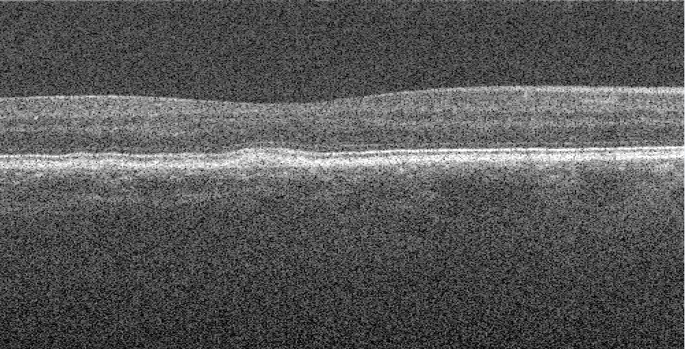
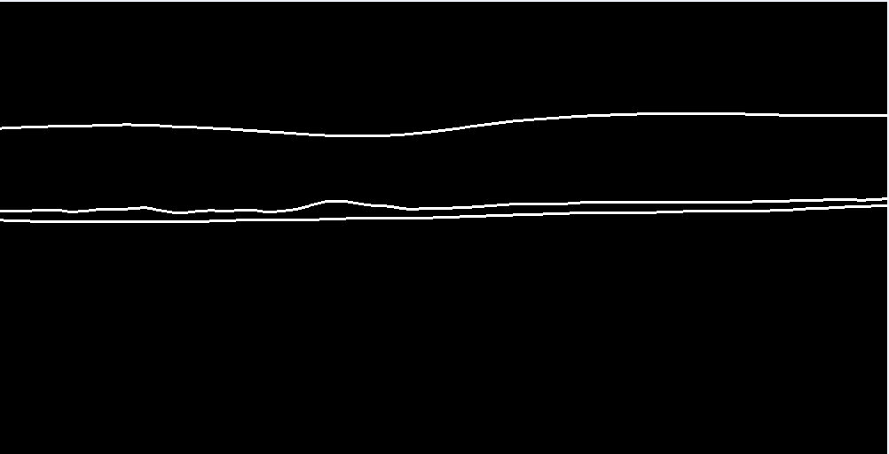

# RPE Drusen Complex Segmentation by UNET 

## Summary

This repo is put together for automatically segmenting the RPE-complex with a convolutional neural network based on the [Unet architecture](http://lmb.informatik.uni-freiburg.de/people/ronneber/u-net/). Together with postprocessing-operations, giving the following results in different datasets as shown in the figure 1. A network was trained with Keras backend on [the Duke University SD-OCT datatset](http://people.duke.edu/~sf59/RPEDC_Ophth_2013_dataset.htm). 

Figure 1. Image predictions of the model with postprocessing

---
## Overview

### Data set & Data preperation
A total of 15744 SD-OCT B-scans (Bioptigen SD-OCT, NC, USA) from 269 AMD patients and 115 normal subjects, selected from the Duke dataset, were used in this study for training and cross-validation. The dataset was split on subject level in 80% training, 20% testing. Validation set was later split from the training set in the ImageDataGenerator function of Keras. 

For training the model, a partition of [the Duke University SD-OCT datatset](http://people.duke.edu/~sf59/RPEDC_Ophth_2013_dataset.htm) was used for training. These images were transfered from their .mat format to .tif images for better use in generators. Only slice 30 to 70 was used, they only had the fully annotated masks. Masks were made by convertining the pixel wide annotated mask to a 3 pixel wide annotated mask which can been seen i. All this preprocessing is done by the code imagemaskfrommat.py. 

|   Figure 2. Example of an converted OCT image by the .mat file   	|    Figure 3. Example of an converted ground thruth mask by the .mat annotation 	|
|---|---|

### Training & Model 
Used in 

